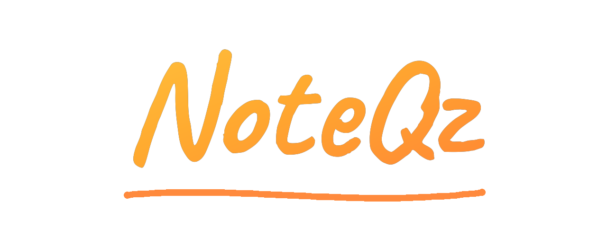

<div align="center">



### ✦ ‧₊˚ A gamified learning app for Class 9 & 10 ˚₊‧ ✦

Bite-sized lessons · smart practice · progress you can actually see
—  in **English** and **हिन्दी**  —

[](https://play.google.com/store/apps/details?id=com.noteqz.app)

<sub>❃ ⋯ download link goes live once the app is published ⋯ ❃</sub>

</div>

<div align="center">

╌╌╌╌╌╌╌╌╌╌╌╌╌╌╌╌╌╌╌ ✦ ✧ ✦ ╌╌╌╌╌╌╌╌╌╌╌╌╌╌╌╌╌╌╌

&nbsp;&nbsp;&nbsp;&nbsp;

╌╌╌╌╌╌╌╌╌╌╌╌╌╌╌╌╌╌╌ ✦ ✧ ✦ ╌╌╌╌╌╌╌╌╌╌╌╌╌╌╌╌╌╌╌

</div>

<br />

## ❖ ⟡ Lessons that stick ⟡

> Every subject opens into chapters, then short, interactive lessons you finish in
> a few minutes. **Science · Mathematics · Social Science** — mapped chapter by
> chapter to the school syllabus.

<br />

## ❖ ⟡ Practice that's actually smart ⟡

Six modes, all drawing from the same question bank your lessons are built on ⤵

|  ❁  | Mode | What it does |
|:---:| --- | --- |
| ☕ | **Daily Mix** | A fresh, balanced set to keep the habit — and the streak — alive |
| 📖 | **Quick Recall** | Chapter summaries to skim before a test |
| ✎ | **By Lessons** | Drill any chapter you've learned, question by question |
| ◎ | **Weak Spot** | A self-clearing queue of everything you got wrong — until you get it right |
| ⏱ | **Exam Sprint** | Weighted like the real paper, so you rehearse where the marks are |
| 🗂 | **PYQs** | Genuine past-year questions — solve by year or by chapter |

<br />

## ❖ ⟡ Progress you can see ⟡

```
   🔥 Streaks        📊 6-month heatmap      🏆 Levels to climb
   🎯 Daily goal     💎 Gems to earn         ✦ Per-topic insights
```

Every topic is scored on your **understanding · recall · accuracy** — so you always
know exactly what to revise next.

<br />

## ❖ ⟡ Fully bilingual ⟡

`EN ⇄ हिन्दी`  — every lesson, question and summary is authored in **both**
English and हिन्दी. Switch your medium anytime.

<br />

## ❖ ⟡ Yours to shape ⟡

✧ Accent colours &nbsp;·&nbsp; ☾ Light & ☀ dark &nbsp;·&nbsp; ◐ Grayscale for
exam-week focus &nbsp;·&nbsp; 𝘈 Reading size &nbsp;·&nbsp; ♪ Sounds &nbsp;·&nbsp;
⏰ Reminders — NoteQz bends to how you like to study.

<br />

## ❖ ⟡ Free to start ⟡

Jump straight in — **lessons and practice are free**. Earn gems as you study, or
watch a short rewarded ad, to unlock even more. Everything you need to learn is
here from day one.

<br />

## ❖ ⟡ Private by design ⟡

🔒 Your progress, streaks and performance analysis are computed and kept on **your
own device**.

<div align="center">

╌╌╌╌╌╌╌╌╌╌╌╌╌╌╌╌╌╌╌ ✦ ✧ ✦ ╌╌╌╌╌╌╌╌╌╌╌╌╌╌╌╌╌╌╌

<sub>
❃ &nbsp; Made for Class 9 &amp; 10 &nbsp;·&nbsp; English &amp; हिन्दी &nbsp;·&nbsp;
<a href="privacy.html">Privacy Policy</a> &nbsp;·&nbsp;
<a href="mailto:noteqz.support@proton.me">noteqz.support@proton.me</a> &nbsp; ❃
</sub>

</div>
